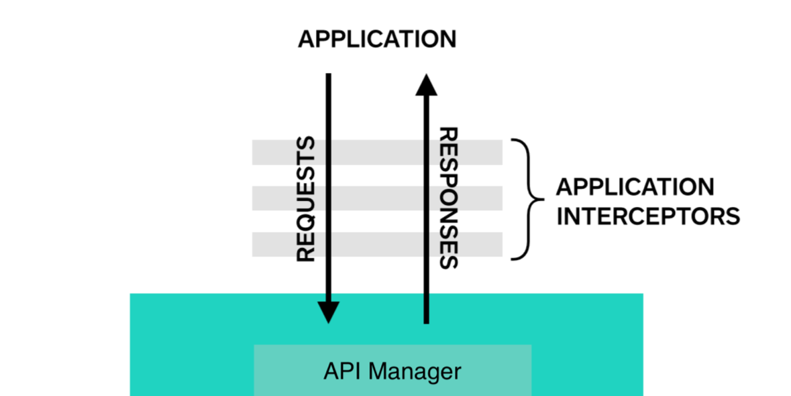

# RCNetworkClient

- Interceptors
- Validators
- Dependency Injection

#### **Interceptors** -

Interceptors are a powerful mechanism that can pre-process or post-process a request




We have declared two protocols – *RequestInterceptor* & *ResponseInterceptor* having one method declaration 

*Request Interceptors* - Pre Request Execution
Headers Definition – Common Headers
Modify Request Body – Append Common details, viz user / device details, wrap body in defined structure, encrypt request body etc

*Response Interceptors* - Post Response Execution       
Parse Response Body – Parse Received response, viz decrypt response data, extract required elements etc – Validate Tokens – Retry/ Validate Session Token and use Event Bus


```swift
class** CommonRequestHeaderInterceptors : RequestInterceptor {

  **func** interceptRequest(request: **inout** URLRequest) {
​    request.addValue("Bearer " + (APIDataManager.appToken ?? ""), forHTTPHeaderField: "Authorization") 
  }

}
```


#### Validators

- Serialization / Deserialization
- Fallback Mechanism
- Common Error Generation
- Bearer Token Management

Network Layer is capable of handling and any request Encodable/ Decodable object serialization / deserialization. We have done that using Generics in POP. Request is hit only if serialization adhering to all mandatory parameters is fulfilled.

For each success response – there is always some error response. Library is capable enough to accept both success / error DAO type and parse response accordingly. Response is reverted only if success DAO deserialization adhering to all mandatory parameters is fulfilled. Otherwise fallback mechanism to deserialize data into error DAO is attempted. Even if that Deserialization is successful – error will be returned as error DAO in error block only

In case any other unexpected error happens. Neither Success nor Error DAO is deserialized then another Decodable error is prepared with respective error code and message and reverted in error block

Another protocol has been defined for  unauthorized access – 401 – bearer token expiration handler – refresh token using that and save in your app data manager – and retry same request

We have declared one protocol – *RetryInterceptor* having one method declaration 


```swift
class** AppTokenRefreshWrapper : RetryInterceptor{

  **func** retryRequest(onSuccess: **@escaping** () -> Void, onError: **@escaping** (APITimeError) -> Void) {

​    **let** params : String = "grant_type=client_credentials"

​    RefreshAppTokenAPI().execute(requestBody: params, onSuccessResponse: { (appToken) **in**

​      APIDataManager.appToken = appToken.access_token

​      onSuccess()

​    }, onErrorResponse: { (error) **in**

​      onError(APITimeError.init(errorCode: RCNetworkConstants.inValidResponse.rawValue, message: RCNetworkConstants.inValidResponse.rawValue))

​    }) { (error) **in**

​      onError(error)

​    }

  }

}
```


#### **Set Up**

**Swift Package Manager**

Add this library to your project using SPM

Git - https://github.com/rakeshchander/RCNetworkClient.git

Version - 1.0.0 or above

Reference - [How to SetUp SPM in project?](https://www.ralfebert.de/ios/swift-package-manager-for-ios-projects/)

**Integration**

At Project Level - Add Extension to APIRequest protocol to define default behaviours across API Calls.

```swift
public** **extension** APIRequest {

  **var** retryInterceptor : (interceptor : RetryInterceptor, errorCodes : [String])?{

​    **get**{

​      (AppTokenRefreshWrapper(), ["401", "400"])

​    }

  }

  **var** interceptors : (requestInterceptors: [RequestInterceptor],responseInterceptors: [ResponseInterceptor])? {

​    **get** {

​      ([CommonRequestHeaderInterceptors()], [])

​    }

  }

  **var** networkClient : NetworkDispatcher {

​    **get** {

​      CoreNetworkClient()

​    }

  }

  **var** mimeType: String {

​    **get**{

​      ""

​    }   

  }

  **var** timeoutInterval : TimeInterval {

​    **get**{

​      30

​    }

  }

  **var** cachingPolicy : URLRequest.CachePolicy {

​    **get**{

​      URLRequest.CachePolicy.useProtocolCachePolicy

​    }  

  }
  
}
```


**API Call Declaration**

- API call can be declared using structs, its simple
- Implement Protocols for required Request Type viz GET, POST

```swift
struct** HomeFeedAPI: GETAPIRequest {   

  **typealias** ResponseType = HomeResponseDAO

  **typealias** ErrorResponseType = AppTokenErrorDAO

  **var** endPoint: String {

​    **return** PlatformConstants.serverURL + PlatformConstants.homeFeed

  }

}
```

For a particular API, if defaults are needed to be overridden then that can also be done as per below-

```swift
struct** RefreshAppTokenAPI: POSTAPIRequest { 

  **typealias** RequestBodyType = String

  **typealias** ResponseType = AppTokenDAO

  **typealias** ErrorResponseType = AppTokenErrorDAO

  **var** endPoint: String {

    **return** PlatformConstants.serverURL + PlatformConstants.refreshAppToken

  }

  **var** interceptors: (requestInterceptors: [RequestInterceptor], responseInterceptors: [ResponseInterceptor])? {

    **return** ([TokenRequestHeaderInterceptor()],[])

  }

}
```

**Execution**

```swift
HomeFeedAPI().execute(requestParams: queryParams, onSuccessResponse: { [weak **self**] (response) **in**

​      // Received Success Response DAO

​    }, onErrorResponse: { [**weak** **self**] (error) **in**

​      // Received Error Response DAO

​    }) { [**weak** **self**] (error) **in**

​      // Received Generic Error

​    }
```


#### Dependency Injection

For making API Call, one default client has already been added to this library - CoreNetworkClient - which uses URLSession.

In case, you want to use some other client - like Alamofire or FCM etc. you an define your own client and declare that in project level setup against var networkClient. It can be customised per API call as well using overridden approach as discussed above.

We have declared one protocol – *NetworkDispatcher* having one method declaration 

```swift
class** AlamofireNetworkClient : NetworkDispatcher{

  **func** consumeRequest(request: URLRequest, onSuccess: **@escaping** (HTTPURLResponse, Data?) -> Void, onError: **@escaping** (APITimeError) -> Void) {

​    Alamofire.request(request)

​      .validate()

​      .responseData { (response) **in**

​        **guard** response.result.isSuccess, **let** httpResponse = response.response **else** {

​          **let** customError = APITimeError.init(errorCode: "\(response.response?.statusCode ?? -1)",message: response.result.error?.localizedDescription ?? "unexpectedError", receivedResponse: response.data)

​          onError(customError)

​          **return**

​        }

​        **guard** **let** responseData = response.data **else**{

​          **let** customError = APITimeError.init(errorCode: "\(httpResponse.statusCode)", message: "unexpectedError", receivedResponse: response.data)

​          onError(customError)

​          **return**

​        }

​        onSuccess(httpResponse, responseData)

​    }

  }

}
```

 **Unit Test**

We can have Mock Network Dispatcher for our Unit Tests target and define our own required responses as per logic test.

```swift
class** CoreNetworkClientMock : NetworkDispatcher {

  **private** **var** targetResponse : Data?

  **private** **var** errorResponse : APITimeError?

  **init**(success:Data?, error:APITimeError?) {

​    targetResponse = success

​    errorResponse = error

  }

  **func** consumeRequest(request: URLRequest, onSuccess: **@escaping** (HTTPURLResponse, Data?) -> Void, onError: **@escaping** (APITimeError) -> Void) {

​    **if** targetResponse != **nil** {

​      **let** fakeResponse = HTTPURLResponse.init()

​      onSuccess(fakeResponse, targetResponse)

​    }**else** {

​      onError(errorResponse!)

​    }

  }

}
```

